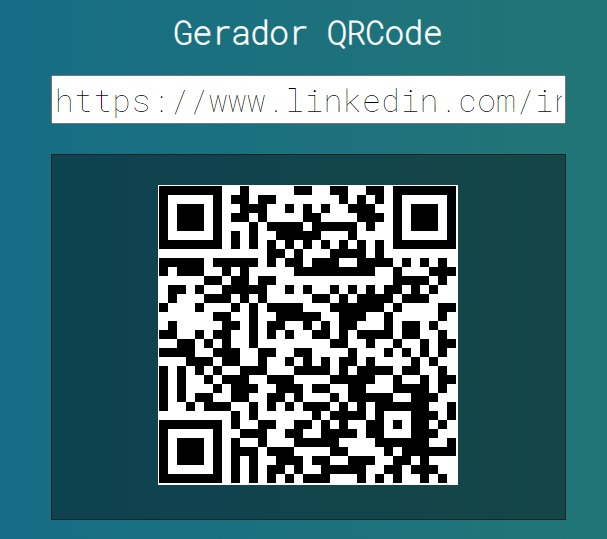

## 💻 Projeto

Projeto desenvolvido durante a **[Curso Web-Moderno JS 2020](https://www.cod3r.com.br/courses/web-moderno)**, realizada pela **[@Cod3r](https://www.cod3r.com.br/)**!! :rocket::rocket:

<p>Tem o Objetivo de criar um Gerador QRCode utilizando o Vue js.</p>

<p align="center">
  
</p>


## 🚀 Tecnologias

- [Vuejs](https://vuejs.org/) 

## Rodando o projeto 🚴🏻‍♂️

```bash

# Clone o repositório
$ git clone https://github.com/arthurfortunato/QrCode.git

# Acesse a pasta do projeto no prompt de comando
$ cd QrCode

# Instale as dependências
$ npm install

# Execute o script "start"
$ npm start

# O projeto inciará na porta: 8080 - acesse http://localhost:8080 
```
